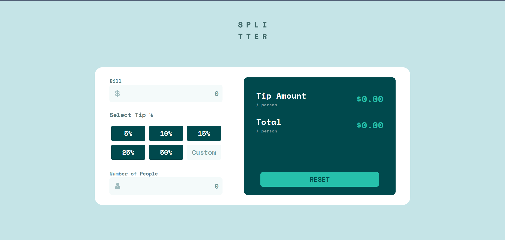

# Frontend Mentor - Tip calculator app solution

This is a solution to the [Tip calculator app challenge on Frontend Mentor](https://www.frontendmentor.io/challenges/tip-calculator-app-ugJNGbJUX). Frontend Mentor challenges help you improve your coding skills by building realistic projects.

## Table of contents

- [Overview](#overview)
  - [The challenge](#the-challenge)
  - [Screenshot](#screenshot)
  - [Links](#links)
- [My process](#my-process)
  - [Built with](#built-with)
  - [What I learned](#what-i-learned)
- [Author](#author)

**Note: Delete this note and update the table of contents based on what sections you keep.**

## Overview

### The challenge

Users should be able to:

- View the optimal layout for the app depending on their device's screen size
- See hover states for all interactive elements on the page
- Calculate the correct tip and total cost of the bill per person

### Screenshot

### Links

- Solution URL: [Github Repo](https://github.com/Mani-mk-mk/FrontendMentor.io/tree/main/tip-calculator-app-main)
- Live Site URL: [Live site](https://mani-mk-mk.github.io/FrontendMentor.io/tip-calculator-app-main/)

### Built with

- Semantic HTML5 markup
- CSS custom properties
- Flexbox
- Mobile-first workflow
- [React](https://reactjs.org/) - JS library

## Author

- Frontend Mentor - [@Mani-mk-mk](https://www.frontendmentor.io/profile/Mani-mk-mk)

### What I learned

Went with a mobile first workflow and I was able to finish developing the site pretty quickly.
I also set the font-size of html tag to 10 px and later on the conversion from px to rem was rather easier and even in the media query if i just want to resize everything i can just increase the define font-size and everything will increase accordingly.
